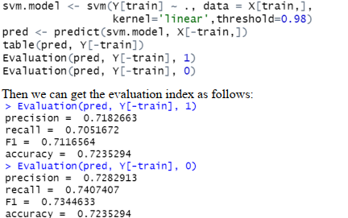
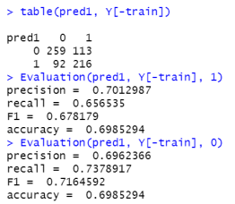

# Sentiment-Analysis-of-Airline-Twitter-Data

## 1. Overview
In the airline industries it is much easier to get feedback from astute data source such as Twitter, for conducting a sentiment analysis on their respective customers. In the report, we go through the steps and methods on the analytics of 3400 rows of tagged airline Twitter data by
exhibiting results of machine learning algorithms using R. The tweets are pre-processed and
classified into negative and non-negative sentiments. Support Vector Machine and Naïve Bayes
models have been used and compared for classifying the sentiments of the tweets. Finally, we
adopt the best performed model on new Twitter data and report the precision of the classification.

## 2. Steps and methods
### Data preprocessing
Load the data set and import the libraries.
Set sentiment value and combine the two datasets.
```{r}
#####Combine two dataset############
#set 1 as negative, 0 as non-negative
complaint$sentiment <- 1
noncomplaint$sentiment <- 0
tweets <- rbind(complaint, noncomplaint)
#encode with UTF-8
tweettext <- iconv(tweets$tweet,"WINDOWS-1252","UTF-8")
```
### Construct Document-Term matrix
##### a. Create corpus using tweet data

##### b. Vocabulary-based vectorization
Define preprocessing function and tokenization function using text2vec

```{r}
#deine preprocessing function and tokenization fucntion using text2vec
it_train = itoken(tweettext,preprocessor = tolower,
                  tokenizer = word_tokenizer,
                  progressbar = F)
stop_words = c("i", "me", "my", "myself", "we", "our", "ours",
               "ourselves", "you", "your", "yours")  
#build vocabulary with create_vocabulary() function
vocab = create_vocabulary(it_train, stopwords = stop_words)
# prune vocabulary
pruned_vocab = prune_vocabulary(vocab,  
                                #delete terms with frequency less than 10
                                term_count_min = 10,   
                                doc_proportion_max = 0.5,  
                                doc_proportion_min = 0.001)


```

##### c. Construct document-term matrix
```{r}
dtm.control = list(dictionary=pruned_vocab$term, tolower=T,
                   removePunctuation=T, removeNumbers=T,
                   stopwords=c(mystop,stopwords('english'), stopwords('spanish'),
                               stopwords('portuguese')),
                   stemming=T, weighting=weightTfIdf)
dtm = DocumentTermMatrix(docs, control=dtm.control)

```

##### d. Convert document term matrix to matrix and factorize the sentiment column
```{r}
#convert dtm to matrix
X <- as.matrix(dtm)
#factorize sentiment
Y <- as.numeric(tweets$sentiment)
```

##### e. Get the random sample in order to separate the dataset into training set and testing set

### Model Training and Evaluation
In this part, I train the model using SVM and NB models, and select the best performed
model by comparing the model evaluation indexes.

##### a. Define evaluation function to get precision, recall, F1 score, and accuracy
```{r}
Evaluation <- function(pred, true, class)
{

  tp <- sum( pred==class & true==class)
  fp <- sum( pred==class & true!=class)
  tn <- sum( pred!=class & true!=class)
  fn <- sum( pred!=class & true==class)
  precision <- tp/(tp+fp)
  recall <- tp/(tp+fn)
  F1 <- 2/(1/precision + 1/recall)
  accuracy <- mean(pred==true)
  cat("precision = ", precision, "\n")
  cat("recall = ", recall, "\n")
  cat("F1 = ", F1, "\n")
  cat("accuracy = ", accuracy,"\n")

}
```

##### b. Training and testing through Support Vector Machine model
```{r}
svm.model <- svm(Y[train] ~ ., data = X[train,], kernel='linear')
pred <- predict( svm.model, X[-train,] )
pred.class <- as.numeric( pred>0.98 )
table(pred.class, Y[-train])
Evaluation(pred.class, Y[-train], 1)
Evaluation(pred.class, Y[-train], 0)
```


##### c. Training and testing through Naïve Bayesion
```{r}
nb.model <- naiveBayes(X[train,], Y[train])
pred1 <- predict(nb.model, X[-train,])
table(pred1, Y[-train])
Evaluation(pred1, Y[-train], 1)
Evaluation(pred1, Y[-train], 0)
```


By comparing the performance, we choose SVM as the final model because of the higher
accuracy and F1 score.

### Predict on new data
##### a. Load data

##### b. Corpus construction and Vocabulary-based vectorization
```{r}
#construct corpus
docs.test <- Corpus(VectorSource(temp$tweet))
it_test = itoken(tweettext,preprocessor = tolower,
                  tokenizer = word_tokenizer,
                  progressbar = F)
# create vocabulary
vocab = create_vocabulary(it_test, stopwords = stop_words)
#prune vocabulary
pruned_vocab = prune_vocabulary(vocab,
                                term_count_min = 10,
                                doc_proportion_max = 0.5,
                                doc_proportion_min = 0.001)
```

##### c. Construct DTM and convert it to matrix

```{r}
# construct dtm
dtm.control = list(dictionary=pruned_vocab$term,
                   tolower=T, removePunctuation=T, removeNumbers=T,
                   stopwords=c(stopwords('english'), stopwords('spanish'),
                               stopwords('portuguese')),
                   stemming=T, weighting=weightTfIdf)
dtm.test <- DocumentTermMatrix(docs.test, dtm.control)
# convert dtm to matrix
dtm.test.matrix <- as.matrix(dtm.test)
```
##### d. Get classification using SVM
```{r}
#prediction using SVM (because of the higher accuracy)
pred <- predict( svm.model, dtm.test.matrix )
pred.class <- as.numeric( pred>0.99 )
#pred.test <- predict(svm.model, dtm.test.matrix)
temp$sentiment = pred.class
nrow(temp[temp$sentiment==1,])
```

## 3. classification precision
After getting the output file, I evaluate whether the sentiment is correct and output my
evaluation result in the second column. 1 denotes the sentiment is correctly classified, and 0 is
the opposite.

In the end, the precision of my classification is about 66.87% (222/332)
